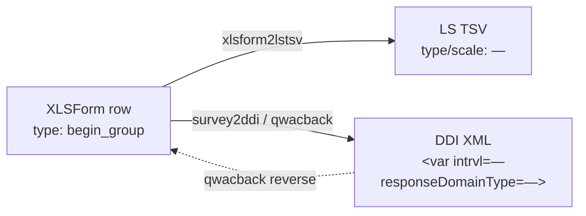

<!-- GENERATED by codegen.py — DO NOT EDIT BY HAND.
     Edit `types/begin_group/definition.jsonld` and re-run `python codegen.py`. -->

# Group (Begin) (`begin_group`)

**Tier:** v1-blessed · **Frozen since:** 2026-05-20

## Concept

- openness: `—`
- cardinality: `—`
- dataNature: `—`

## Cross-format mapping

| Format | Value |
|--------|-------|
| XLSForm typeString | `begin_group` |
| LimeSurvey type code | `—` |
| DDI `intrvl` | `—` |
| DDI `responseDomainType` | `—` |
| DDI `varFormat/@type` | `—` |
| qwacback `answerType` | `—` |

## Lifecycle across the ecosystem

## Variants

| ID | Label | Notes |
|----|-------|-------|
| [`grid`](examples/grid/) | Matrix / Likert-Skala — Institutionsvertrauen | appearance=table-list |

## Constraints

_None._

## Round-trip

| Property | Value |
|----------|-------|
| roundTripSafe | ⚠️ |
| lossless | ⚠️ |

## Warnings

- ⚠️ Plain groups lost in XLSForm → DDI → XLSForm round trip
- ⚠️ Always use appearance='table-list' if group structure matters
- ⚠️ Nested groups flattened in LimeSurvey (not supported)

## Tests

- `tests/transformations/test_xlsform_to_ddi.py` (parametrized)
- `tests/transformations/test_xlsform_to_lstsv.py` (parametrized)
- `tests/transformations/test_snapshots.py` (per-variant ddi.xml + tsv.tsv)
- `tests/transformations/test_ddi_validation.py` (XSD + schematron over blessed snapshots)

## Source

- [`definition.jsonld`](definition.jsonld) — the QuestionType entry (single source for codegen)
- `examples/<variant>/` — XLSForm payload + derived ddi.xml/tsv.tsv/xlsx + meta.json
