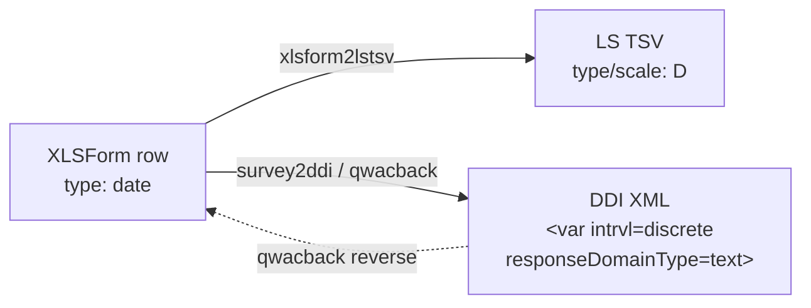

<!-- GENERATED by codegen.py — DO NOT EDIT BY HAND.
     Edit `types/date/definition.jsonld` and re-run `python codegen.py`. -->

# Date (`date`)

**Tier:** v1-blessed · **Frozen since:** 2026-05-20

## Concept

- openness: `open`
- cardinality: `single`
- dataNature: `temporal`

## Cross-format mapping

| Format | Value |
|--------|-------|
| XLSForm typeString | `date` |
| LimeSurvey type code | `D` |
| DDI `intrvl` | `discrete` |
| DDI `responseDomainType` | `text` |
| DDI `varFormat/@type` | `character` |
| qwacback `answerType` | `text` |

## Lifecycle across the ecosystem

## Constraints

- Variable name ≤ 20 chars, pattern `^[a-zA-Z0-9]+$`

## Round-trip

| Property | Value |
|----------|-------|
| roundTripSafe | ✅ |
| lossless | ✅ |

## Warnings

_None._

## Tests

- `tests/transformations/test_xlsform_to_ddi.py` (parametrized)
- `tests/transformations/test_xlsform_to_lstsv.py` (parametrized)
- `tests/transformations/test_snapshots.py` (per-variant ddi.xml + tsv.tsv)
- `tests/transformations/test_ddi_validation.py` (XSD + schematron over blessed snapshots)

## Source

- [`definition.jsonld`](definition.jsonld) — the QuestionType entry (single source for codegen)
- `examples/<variant>/` — XLSForm payload + derived ddi.xml/tsv.tsv/xlsx + meta.json
