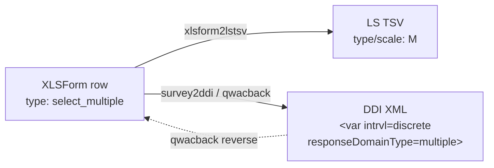

<!-- GENERATED by codegen.py — DO NOT EDIT BY HAND.
     Edit `types/select_multiple/definition.jsonld` and re-run `python codegen.py`. -->

# Multiple Choice (Checkboxes) (`select_multiple`)

**Tier:** v1-blessed · **Frozen since:** 2026-05-20

## Concept

- openness: `closed`
- cardinality: `multiple`
- dataNature: `categorical`

## Cross-format mapping

| Format | Value |
|--------|-------|
| XLSForm typeString | `select_multiple` |
| LimeSurvey type code | `M` |
| DDI `intrvl` | `discrete` |
| DDI `responseDomainType` | `multiple` |
| DDI `varFormat/@type` | `numeric` |
| qwacback `answerType` | `multiple_choice` |

## Lifecycle across the ecosystem

## Variants

| ID | Label | Notes |
|----|-------|-------|
| [`multiple_choice`](examples/multiple_choice/) | Multiple Choice — Wochenendtage | — |
| [`multiple_choice_other`](examples/multiple_choice_other/) | Multiple Choice mit Sonstiges — Gerätebesitz | `or_other` |
| [`multiple_choice_long_list`](examples/multiple_choice_long_list/) | Multiple Choice (Lange Liste) — Besuchte Länder | external file, appearance=minimal |

## Constraints

- Variable name ≤ 20 chars, pattern `^[a-zA-Z0-9]+$`
- Choice code ≤ 5 chars, pattern `^[a-zA-Z0-9]+$` (truncated in LimeSurvey, prefix collisions warned)
- ⚠️ Choice codes > 5 chars will be truncated in LimeSurvey
- ⚠️ Avoid choice codes with identical 5-char prefixes

## Round-trip

| Property | Value |
|----------|-------|
| roundTripSafe | ⚠️ |
| lossless | ⚠️ |

## Warnings

- ⚠️ Data structure fundamentally changes during transformation
- ⚠️ Original column contains space-separated codes; DDI exports n binary columns

## Tests

- `tests/transformations/test_xlsform_to_ddi.py` (parametrized)
- `tests/transformations/test_xlsform_to_lstsv.py` (parametrized)
- `tests/transformations/test_snapshots.py` (per-variant ddi.xml + tsv.tsv)
- `tests/transformations/test_ddi_validation.py` (XSD + schematron over blessed snapshots)

## Source

- [`definition.jsonld`](definition.jsonld) — the QuestionType entry (single source for codegen)
- `examples/<variant>/` — XLSForm payload + derived ddi.xml/tsv.tsv/xlsx + meta.json
