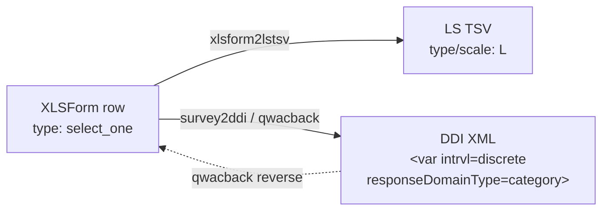

<!-- GENERATED by codegen.py — DO NOT EDIT BY HAND.
     Edit `types/select_one/definition.jsonld` and re-run `python codegen.py`. -->

# Single Choice (Radio Buttons) (`select_one`)

**Tier:** v1-blessed · **Frozen since:** 2026-05-20

## Concept

- openness: `closed`
- cardinality: `single`
- dataNature: `categorical`

## Cross-format mapping

| Format | Value |
|--------|-------|
| XLSForm typeString | `select_one` |
| LimeSurvey type code | `L` |
| DDI `intrvl` | `discrete` |
| DDI `responseDomainType` | `category` |
| DDI `varFormat/@type` | `numeric` |
| qwacback `answerType` | `single_choice` |

## Lifecycle across the ecosystem

## Variants

| ID | Label | Notes |
|----|-------|-------|
| [`single_choice`](examples/single_choice/) | Single Choice — Bildungsgrad | — |
| [`single_choice_other`](examples/single_choice_other/) | Single Choice mit Sonstiges — Aufmerksamkeitsquelle | `or_other` |
| [`single_choice_long_list`](examples/single_choice_long_list/) | Single Choice (Lange Liste) — Geburtsland | external file, appearance=minimal |

## Constraints

- Variable name ≤ 20 chars, pattern `^[a-zA-Z0-9]+$`
- Choice code ≤ 5 chars, pattern `^[a-zA-Z0-9]+$` (truncated in LimeSurvey, prefix collisions warned)
- ⚠️ Choice codes > 5 chars will be truncated in LimeSurvey

## Round-trip

| Property | Value |
|----------|-------|
| roundTripSafe | ✅ |
| lossless | ✅ |

## Warnings

- ⚠️ Choice code truncation can cause ambiguity if two codes share 5-char prefix

## Tests

- `tests/transformations/test_xlsform_to_ddi.py` (parametrized)
- `tests/transformations/test_xlsform_to_lstsv.py` (parametrized)
- `tests/transformations/test_snapshots.py` (per-variant ddi.xml + tsv.tsv)
- `tests/transformations/test_ddi_validation.py` (XSD + schematron over blessed snapshots)

## Source

- [`definition.jsonld`](definition.jsonld) — the QuestionType entry (single source for codegen)
- `examples/<variant>/` — XLSForm payload + derived ddi.xml/tsv.tsv/xlsx + meta.json
